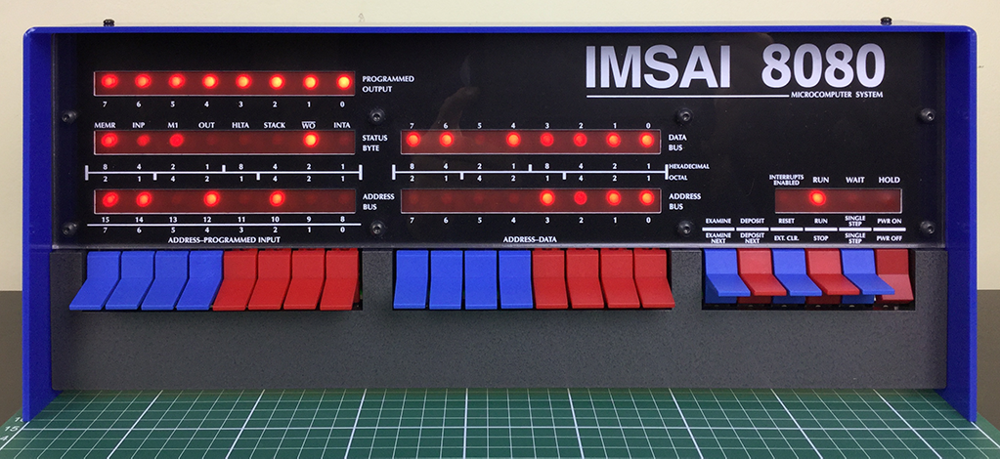

# Configuration (Draft)

## Default configuration

### IMSAI 8080 (guest)

::: warning
The default configuration is like an empty machine with no ROM only RAM.
:::

- RAM is 64K occupying the entire address space from `0000h` to `FFFFh`
- CPU is Intel 8080 @ 2MHz with support for undocumented op-codes
- no boot ROM

### ESP32 (host)

- Wi-Fi set to **Access-Point (AP)** mode with the default SSID of `imsai8080`, password of `password`
- Hostname (HOSTNAME environment variable) set to `imsai8080` (`imsai8080.local` for MDNS)
- Port (PORT environment variable) set to `80`
- Timezone (TZ environment variable) set for AEST+10, ADST+11 (ie. Sydney, Australia)
- Time server (NTP_SERVER environment variable) set to `pool.ntp.org`
- POST (Power On Self Test) disabled
- Console log level set to `NONE` (details to follow)

::: tip
Once you are connected to the Wi-Fi network, start a Chrome browser and enter the URL `http://imsai8080.local` to see the Desktop UI.
:::

## Startup configuration (Non-Volatile Storage, NVS)

The startup configuration is modified via the toggle switches on the front panel.

To enter *startup configuration mode*, follow the sequence:

1. ensure the ESP32 is connected to a USB power source, the red LED on the ESP32 board should be illuminated
2. turn the front panel power switch **off**, `PWR OFF`, the down position
3. hold the `EXAMINE` toggle in the **Examine**, up position
4. press the `Reset` switch while holding the `EXAMINE` toggle up
5. release the `EXAMINE` toggle

The IMSAI 8080esp should now be in *startup configuration mode*. This is indicted by a running LED pattern (right to left) on the 4 LEDS at the right hand side of the front panel (`HOLD`, `WAIT`, `RUN`, `INTERRUPTS ENABLED`).

::: tip 
There are 2 `Reset` switches available that both do the same thing:

- The `Tactile Switch SPST-NO` you installed in the `Reset` position on the PCB
- The small tactile switch on the ESP32 board marked `EN`
:::

::: tip Booting into MSBASIC 1.4 (8K)
To configure the IMSAI 8080esp to boot directly into a ROM based *MSBASIC 1.4 (8K)* in 8080 mode @ 2 Mhz, the following startup configuration value can be used.

- Binary: 0000 0100 0000 0000
- Octal: 002000
- Hexadecimal: 0400

1. Enter *startup configuration mode* (above)
2. Toggle in this value on the **Address** toggle switches
3. Raise the `DEPOSIT` toggle to the **Deposit**, up position to store the entered startup configuration value.
4. Reboot the IMSAI 8080esp by pressing a `Reset` switch
:::

::: tip Booting into XYBASIC
To configure the IMSAI 8080esp to boot directly into a ROM based *XYBASIC* in Z80 mode @ 4 Mhz, the following startup configuration value can be used.

- Binary: 0000 0101 0101 0000
- Octal: 002520
- Hexadecimal: 0550

1. Enter *startup configuration mode* (above)
2. Toggle in this value on the **Address** toggle switches
3. Raise the `DEPOSIT` toggle to the **Deposit**, up position to store the entered startup configuration value.
4. Reboot the IMSAI 8080esp by pressing a `Reset` switch
:::

::: tip Booting into CP/M 2.2

To configure the IMSAI 8080esp to boot from the disk image in drive `DSK:A:` in Z80 mode @ 4 Mhz, the following startup configuration value can be used. You can mount the `cpm_22.dsk` disk image in drive `DSK:A:` via the *Desktop UI*.

- Binary: 0000 1001 0101 0000
- Octal: 004520
- Hexadecimal: 0950

1. Enter *startup configuration mode* (above)
2. Toggle in this value on the **Address** toggle switches
3. Raise the `DEPOSIT` toggle to the **Deposit**, up position to store the entered startup configuration value.
4. Reboot the IMSAI 8080esp by pressing a `Reset` switch
:::

| Address Bit | Name | Equivalent Flag | Description |
| ----------: | ---- | --------------- | ----------- |
| 0 | NVS_POST | n/a | Enable Power On Self Test (POST) |
| 1-2 | NVS_LOG_LEVEL | n/a | Set ESP32 console **Log Level**, 0 = NONE; 1 = ERROR; 2 = WARN; 3 = INFO |
| 3 | NVS_IF_STA | n/a | Set Wi-Fi Mode,  0 = Access Point Mode (AP); 1 = Station Mode (STA) |
| 4 | NVS_Z80 | `-z`, `-8` | Enable Z80 CPU emulation, 0 = 8080 `-8`; 1 = Z80 `-z` |
| 5 | NVS_NO_UNDOC | `-u` | Suppress support for undocumented op. codes, 1 = `-u` |
| 6 | NVS_4MHZ | `-f` | Set CPU speed, 0 = 2 MHz `-f 2`; 1 = 4 Mhz `-f 4` |
| 7 | NVS_UNLIMITED | `-f 0` | Set CPU speed to Unlimited, 0 = use speed from bit 6; 1 = Unlimited `-f 0` |
| 8-10 | NVS_BOOT_ROM | `-x` | Set boot ROM to 1 of 7 *slots*, 0 = No boot ROM, 1-7 = use slot *n* `-x $ROMn` |
| 11 | NVS_BANK_ROM | `-r` | Enable **MPU-B(A)** style Banked ROM/RAM functionality, 1 = `-r`. Only compatible with MPU-A ROM images. |
| 12-15 | | | Reserved for future use |

To set the startup configuration mode value, follow the sequence:

1. To **set** a bit, put the corresponding **Address** toggle switch in the **up** position.
2. To **clear** a bit, put the corresponding **Address** toggle switch in the **down** position.
3. Raise the `DEPOSIT` toggle to the **Deposit**, up position to store the entered startup configuration value.

::: warning
The IMSAI 8080esp must be rebooted for the new configuration to take effect. This can be done by pressing a `Reset` switch.
:::

::: tip
For further details about the *Equivalent Flag* refer to the **Z80PACK** documentation for the **imasaisim** machine.
:::

## Serial Communications (RS232, USB)

TBA

## Wi-Fi Communications

TBA

## Boot.conf file

TBA

## System.conf file

TBA
